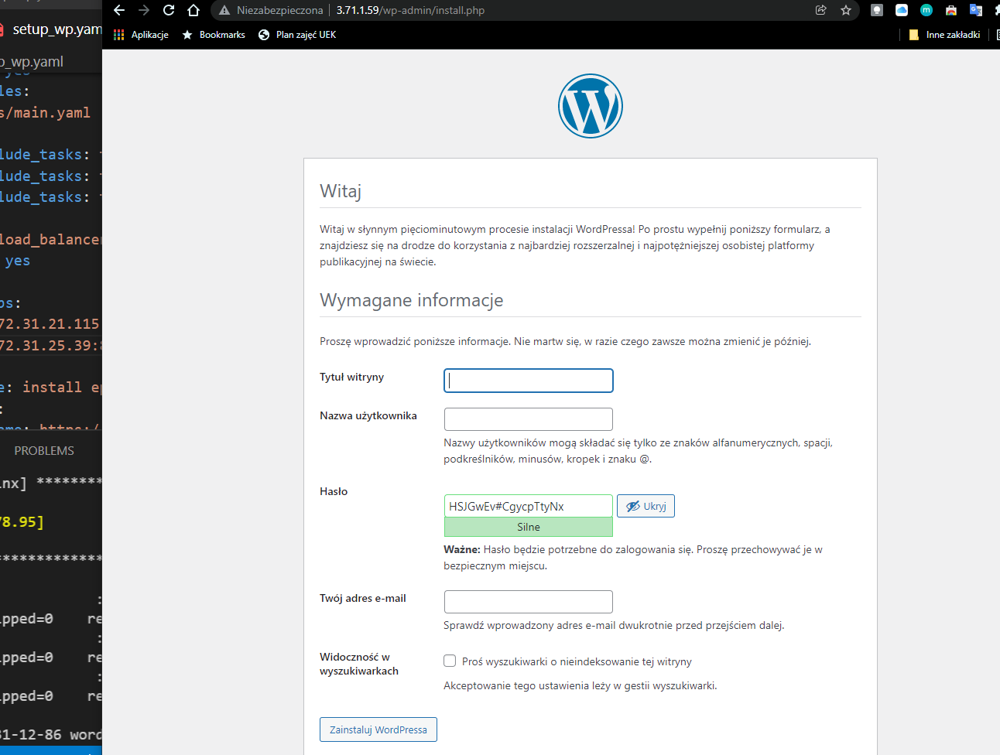

## Install wordpress
we use 'ansible' with setup_wp.yaml in order to automate the process of installing wordpress and all dependencies on our AWS machines.

The setup_wp.yaml file consists of below steps:
- getting, installing and starting MariaDB, creating database for our wordpress, creating user and assigning privileges // steps are imported from tasks/db_related.yaml
- installing http server, EPEL, PHP from repo and its packages (tasks/os_packages.yaml)
- downloading wordpress and putting config file (blog.conf) to conf.d folder  (/etc/httpd/conf.d) then copying wordpress config file (wp-config.php) to /var/www/wordpress. After that we need to reload httpd in order to start apache.


```sh
ansible-playbook -i hosts.ini setup_wp.yaml -e DB_PW='Wordpress1!'
```


